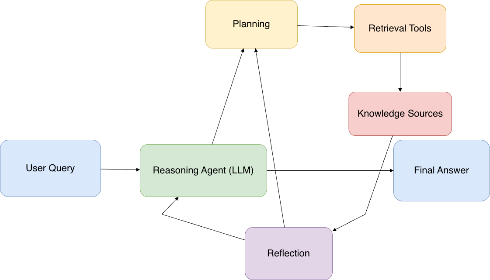

# Plain RAG → Agentic RAG

**A Thinking Document for SaaS / B2B Software Engineers**

---

## Section 1 — The Human Story

In late 2017, a small group of researchers at Facebook AI were working on what was then called "open-domain question answering." The setup was simple to describe and brutal to actually build: someone asks a question, the system has to find the answer somewhere on the internet (or in Wikipedia, in their case), and then has to generate a fluent, accurate sentence that answers the question. Nothing about it was new. People had been working on question answering since the 1960s. But the systems they built kept hitting the same wall — they were either great at finding documents (information retrieval) or great at generating fluent answers (sequence-to-sequence models), but never both. The two halves of the problem refused to talk to each other.

The frustration wasn't intellectual. It was practical. You could build a system that retrieved beautiful, on-topic Wikipedia paragraphs and then completely failed to summarize them — because the summarizer had been trained on different data and didn't actually "read" the retrieved text in any meaningful way. Or you could build a sequence-to-sequence model that wrote gorgeous, fluent answers — that were completely made up. Both halves worked. The seam between them was where everything broke.

And around the same time, a parallel frustration was building in industry: large language models like BERT and the early GPT family were getting fluent enough that businesses wanted to deploy them — but the models hallucinated constantly, had no idea about the company's actual data, and there was no obvious way to "teach" them new information short of retraining the entire model. Retraining was expensive, slow, and nobody knew if the new information would even stick.

---

### The Breakthrough

The breakthrough came in a 2020 paper by Patrick Lewis and colleagues at Facebook AI titled *Retrieval-Augmented Generation for Knowledge-Intensive NLP Tasks* — the paper that gave **RAG** its name.

The core idea was almost embarrassingly simple in retrospect: **don't try to put knowledge inside the model. Put the knowledge next to the model at the moment of the question.** Retrieve the relevant passages from your corpus, paste them into the prompt, and let the language model read them while it generates the answer.

Two systems that previously refused to cooperate were suddenly forced to share the same input. And it worked. Hallucination rates dropped. Knowledge updates became a database operation, not a training run. The retrieval system did what retrieval systems are good at; the generator did what generators are good at; and the seam between them was — literally — concatenation.

---

What made RAG inevitable wasn't the algorithm. It was the recognition that **memorizing the world is the wrong frame for a language model**. A language model is good at language. The world's facts belong somewhere else — in a document store, a database, a vector index — and the model should consult that store the way a doctor consults a patient chart at the moment of the appointment, not the way a student crams for an exam.

Once that frame clicked, RAG didn't feel like an invention. It felt like an **obvious correction to a category error**.

The astonishing thing isn't that RAG works. The astonishing thing is that anyone ever expected language models to know things in the first place.


## STEP 2 — The Intuition Build

Imagine a veteran Account Manager at a B2B SaaS company preparing for a high-stakes renewal meeting. A client asks a complex question: 

> "How does our feature adoption over the last quarter justify the 20% price increase in the new enterprise contract?"

The Account Manager doesn't just grab the first document they see. They perform a mental loop:

1. First, they pull up the client's usage dashboard (**Action**).
2. They notice adoption is high in "Advanced Analytics" but low in "Seat Management."
3. They think: "Wait, I need to check the Product Roadmap to see if 'Seat Management' is being deprecated or upgraded" (**Self-correction / Reasoning**).
4. They pull the Roadmap PDF and find the upgrade details.
5. Finally, they cross-reference this with the New Pricing Sheet to build a justified response.

---

This behavior — checking a source, evaluating what’s missing, and deciding to look elsewhere — is **exactly** what Agentic RAG is.

In your B2B SaaS environment, **Agentic RAG isn't just "searching the docs."** It is a Reasoning Agent that has been given "Retrieval" as a high-performance tool. 

Instead of being a student who reads a single Wikipedia summary before an exam, it’s the researcher who goes into the library, reads a chapter, realizes it's outdated, checks the footnotes for a better source, and doesn't stop until the evidence is bulletproof.

It moves the system from:

> "I found some text that looks like your question"

to:

> "I am investigating your question across multiple knowledge silos until I can prove my answer is correct."


## STEP 3 — The Pattern Anatomy

### Part A — Plain language anatomy

Agentic RAG transforms the static "Retrieve → Read → Answer" pipeline into a **dynamic loop**. In this system, the "Retriever" is no longer a fixed entry point; it is a **tool** in the agent’s belt. 

The system starts with a reasoning engine (the LLM) that analyzes the user's query and decides:
- Which knowledge base to hit,
- How to phrase the search,
- And — crucially — evaluates if the results are "good enough" to answer the user.

If the information is missing or ambiguous, the agent loops back, reformulates its query, and tries again.



### Part B — The anatomy table

| What the pattern is          | What it can handle                                      | What it cannot handle                              | What you're betting on                              |
|-----------------------------|---------------------------------------------------------|----------------------------------------------------|-----------------------------------------------------|
| **Retrieval-as-a-Tool**     | Multi-step research across fragmented SaaS silos (Docs, CRM, Slack) | High-latency sensitive "instant" chat where a 2-second delay is a failure | Reasoning can overcome poor initial search queries by iterating |

### Part C — The four-pattern comparison

**Agentic RAG is a composition of RAG and Tool Use**, often controlled by a Planning loop.

- In **Naive RAG**, retrieval is the infrastructure.
- In **Agentic RAG**, retrieval is a **Tool**.

This shift means you can give an agent multiple RAG tools (e.g., `search_technical_docs`, `search_legal_contracts`, `search_customer_history`). The agent uses **Planning** to decide the order of search and **Reflection** to grade the relevance of the chunks before generating the final B2B response.


## STEP 4 — The Tool / Retrieval / Coordination Choices

### Part A — Plain language explanation

In a B2B SaaS context, your biggest enemy isn't a lack of data; it's **contextual fragmentation**. Your technical docs say one thing, your pricing page says another, and the client’s custom contract says a third. 

In Agentic RAG, you must decide the **"granularity"** of your retrieval tools. If you give the agent one giant "Search All" tool, it gets overwhelmed by noise. If you give it hyper-specific tools, it might not know which one to pick. 

The key design choice is providing the agent with tools that **mirror your Business Domains**, not your database tables.

### Part B — Why these specific choices

Agentic RAG specifically chooses to treat retrieval as an **iterative tool** because first-attempt searches are often wrong. In B2B, users ask "Why is my bill high?" but the answer is buried in a chunk about "Data Egress Fees." 

An agentic system allows the LLM to realize, "I found pricing info, but I'm missing the user's actual usage stats," and then trigger a second, targeted retrieval.

### Part C — Thinking Framework #3 applied to Agentic RAG

**THINKING FRAMEWORK #3 APPLIED TO AGENTIC RAG:**  
*The retrieval pipeline is a business decision, not a technical one*

In your B2B SaaS, deciding between "Vector Search" and "Agentic RAG" is a decision about the **cost of being wrong**. If a customer is asking about API integration, a 50% accurate answer from a vector store is a support ticket. An Agentic RAG system that takes 10 seconds longer but reformulates its query three times to find the exact edge-case documentation is a "ticket prevented."

You are trading latency and compute cost for **"Information Completeness."** In B2B, where churn is expensive and "hallucinated" features can lead to legal disputes, the business decision usually favors the thoroughness of the agentic loop over the speed of the naive one.

### Part D — Reality Check

```markdown
REALITY CHECK
If you ignore this concept:
- The agent retrieves a "Standard Tier" pricing chunk for a "Premium Enterprise" client because the query didn't specify the tier, leading to a confident but wrong billing explanation.
- The agent fails to find an answer because the user used a synonym (e.g., "discount") that wasn't in the vector index, and the system didn't have the "agency" to try searching for "incentives" or "rebates."

Consequence: Your "AI Support" becomes a source of misinformation that Account Managers have to constantly correct.

```


## STEP 5 — The Coordination / Control Flow

### Part A — Plain language explanation

In Agentic RAG, the control flow moves from a **"one-way street"** to a **"roundabout."** The system doesn't just pass data forward; it evaluates the data it finds and decides whether to exit (answer the user) or take another lap (search again).

Instead of a fixed script, the flow is governed by a **Self-Correction Loop**. The agent identifies a gap, executes a search tool, critiques the result for completeness, and reformulates its next search based on what it just learned.

### Part B — The Coordination Callout

```markdown
THIS IS WHERE THE REAL LEARNING IS:

Agentic RAG shifts the coordination from the infrastructure to the Agent.
In Naive RAG, the system is a pipe. In Agentic RAG, the system is a Research Assistant.

This means Thinking Framework #5 (planning is the universal coordinator)
has an important qualifier: it's universal for *single-agent* systems.
Agentic RAG is a Multi-Step Planning loop.

What this teaches you about agent thinking: The "Thinking" happens in the 
interstices between retrieval steps. The most valuable reasoning isn't 
summarizing the answer—it's identifying what is STILL MISSING after 
the first search.
```

### Part C — The Failure Signature

The primary failure mode here is the "Search Rabbit Hole." Because the agent is allowed to keep searching, it might get stuck in a loop of reformulating the same query or exploring irrelevant knowledge silos until it hits your max_iterations limit.

This is a "coordination failure" that simple ReAct loops don't produce because they lack the depth of Agentic RAG's knowledge-seeking behavior.


## STEP 6 — All 13 Thinking Frameworks Applied

This is the centerpiece of the document. We are going to stress-test the Agentic RAG pattern against the 13 frameworks that define senior-level AI engineering.

### THINKING FRAMEWORK #1: Pattern selection is the highest-leverage skill

**Core insight:** The most important decision happens before you build: which patterns does this problem actually need?

**Applied to Agentic RAG:**  
In B2B SaaS, you choose Agentic RAG when the cost of a "not found" or "partial" answer is high. If a user asks a complex technical integration question, Naive RAG might give them step 1 of 5. Agentic RAG recognizes it only has step 1, searches again for step 2, and continues until the integration guide is complete.

**Compared to the four core patterns:**  
- [ ] Identical  
- [X] Similar — It’s an evolution. You are specifically selecting to "up-level" RAG by adding Agency.  
- [ ] Fundamentally different

---

### THINKING FRAMEWORK #2: Every tool is a hypothesis

**Core insight:** Know a tool's limitations before you give it to the agent.

**Applied to Agentic RAG:**  
You aren't just giving the agent a "Search" tool; you are hypothesizing that your vector database can actually find relevant chunks for the queries the agent generates. In B2B SaaS, if your agent generates a query for "GDPR compliance in Germany" but your docs only use the term "DSGVO," the hypothesis fails unless you have a tool that handles expansion or synonym mapping.

**Compared to the four core patterns:**  
- [ ] Identical  
- [ ] Similar  
- [X] Fundamentally different — In Agentic RAG, the "Tool" (Search) is the primary source of the agent's "Truth," making the hypothesis much higher stakes than a simple calculator tool.

---

### THINKING FRAMEWORK #3: The retrieval pipeline is a business decision

**Core insight:** Retrieval choices drive business outcomes.

**Applied to Agentic RAG:**  
For your SaaS platform, deciding to include "Slack archives" or "Jira tickets" in the Agentic RAG loop is a business risk decision. The agent might find an internal developer's comment saying "this feature is buggy," which is technically "correct" but business-inappropriate to show a customer. Agentic RAG forces you to define which knowledge silos are "safe" for the agent to explore autonomously.

**Compared to the four core patterns:**  
- [X] Identical — Works exactly the same way as the foundational RAG pattern, but with more complexity as the agent navigates multiple pipelines.

---

### THINKING FRAMEWORK #4: The universal agent architecture

**Core insight:** Tool Use, RAG, Planning, Reflection.

**Applied to Agentic RAG:**  
Agentic RAG is the most balanced expression of this architecture. It uses RAG for data, Tool Use to trigger the searches, Planning to handle multi-part queries, and Reflection to decide if the retrieved data is sufficient.

**Compared to the four core patterns:**  
- [X] Identical — This pattern is the "poster child" for the universal architecture.


## STEP 6 — All 13 Thinking Frameworks Applied (Continued)

### THINKING FRAMEWORK #5: Planning is the universal coordinator

**Core insight:** Planning decomposes complex goals, but the variant (static vs. replanning) determines reliability.

**Applied to Agentic RAG:**  
In B2B SaaS, a query like "How do I migrate my legacy API keys and update my billing?" requires a **Replanning loop**. The agent can't know the migration steps until it first retrieves your "Migration Guide." Only then can it "replan" to look up the "Billing Update" section. Static planning fails here because the second half of the task depends on the knowledge found in the first.

**Compared to the four core patterns:**  
- [ ] Identical  
- [X] Similar — same principle, different execution  
- [ ] Fundamentally different

---

### THINKING FRAMEWORK #6: The composition vs complexity tradeoff

**Core insight:** Senior engineers compose simple agents rather than building one "god-agent."

**Applied to Agentic RAG:**  
Instead of one agent that searches technical docs, legal terms, and usage data, you might compose an Agentic RAG Router. One "Researcher" agent finds the data, and one "Synthesizer" agent writes the final response. This prevents the researcher from getting "writer's block" and the synthesizer from getting "distracted" by irrelevant search results.

**Compared to the four core patterns:**  
- [ ] Identical  
- [ ] Similar  
- [X] Fundamentally different — and here is why that matters:  
  In Agentic RAG, the complexity is in the interaction with data. Composing agents allows you to separate the "Search Specialist" from the "Customer-Facing Writer."

---

### THINKING FRAMEWORK #7: Hallucination is the silent killer

**Core insight:** Confident wrong answers are indistinguishable from truth without verification.

**Applied to Agentic RAG:**  
The biggest risk in Agentic RAG is **"Source-Selection Hallucination."** The agent retrieves a chunk about "User Permissions" and uses it to answer a question about "API Scopes." It looks grounded because there are citations, but the agent has misapplied the context.

**Compared to the four core patterns:**  
- [X] Identical — This is the constant battle of RAG systems.

---

### THINKING FRAMEWORK #8: How you ground answers matters as much as that you ground them

**Core insight:** Use explicit citations and verification.

**Applied to Agentic RAG:**  
For your SaaS, grounding isn't just about text. If the agent says "You have 3 seats remaining," it must ground that in a specific API call to your CRM tool, not a text chunk from a general "Pricing PDF." Agentic RAG allows you to ground different parts of the answer in different types of tools (RAG for docs, API tools for live data).

**Compared to the four core patterns:**  
- [ ] Identical  
- [X] Similar — same principle, different execution

---

### THINKING FRAMEWORK #9: Reflection is universal — but what kind of correctness do you need?

**Core insight:** Match the reflection depth to the stakes of the answer.

**Applied to Agentic RAG:**  
In B2B, you need **Tool-Grounded Reflection**. After the agent gathers information, a "Critic" loop must ask: "Does this answer actually resolve the customer's technical error, or is it just quoting the manual?" If the reflection fails, the agent is forced back into the retrieval loop.

**Compared to the four core patterns:**  
- [X] Identical

---

### THINKING FRAMEWORK #10: Report business metrics, not just technical ones

**Core insight:** Stakeholders care about business outcomes, not token counts.

**Applied to Agentic RAG:**  
Don't just report "Retriever Recall." Report "Automatic Ticket Resolution Rate" or "Time-to-Implementation Saved." If Agentic RAG is 3x more expensive than Naive RAG but prevents a churn event worth Rs 5,00,000, that is the metric that matters.

**Compared to the four core patterns:**  
- [X] Identical

---

### THINKING FRAMEWORK #11: The best tools come from domain workflows

**Core insight:** Mirror the verbs and actions of the people doing the work today.

**Applied to Agentic RAG:**  
Your tools shouldn't be `search_vdb`. They should be `check_compliance_policy` or `lookup_integration_specs`. By naming tools after SaaS workflows, the agent "thinks" more like one of your senior support engineers.

**Compared to the four core patterns:**  
- [X] Identical

---

### THINKING FRAMEWORK #12: Violated assumptions give you confidently wrong agents

**Core insight:** Every system has hidden assumptions that break in production.

**Applied to Agentic RAG:**  
The assumption is that "All relevant information is indexed." In B2B SaaS, information often lives in private Slack threads or unrecorded Zoom calls. If the agent assumes it has the full truth but only has the documented truth, it will give incomplete advice.

**Compared to the four core patterns:**  
- [X] Identical

---

### THINKING FRAMEWORK #13: The pipeline is universal, but the gotchas at each stage die

**Core insight:** Success is in the details of the implementation.

**Applied to Agentic RAG:**  
The "Gotcha" in Agentic RAG is the **Context Window Overload**. If the agent searches 5 times and retrieves 5 chunks each time, the context window fills with 25 chunks. The LLM gets "lost in the middle." Senior engineers summarize previous search results before the next search to keep the "reasoning space" clean.

**Compared to the four core patterns:**  
- [X] Identical


## STEP 7 — Agent Moments

Here are the critical decision points where your expertise as a B2B AI Engineer is required to guide the model.

### AI CODING AGENT MOMENT #1: The "Search-Termination" Threshold

**Why the framework cannot do this alone:**  
The framework doesn't know the cost of latency versus the cost of silence. In B2B SaaS, searching 10 times to find a "maybe" answer might frustrate a user more than a quick "I'll escalate this to your Account Manager." You must define the "Good Enough" signal.

**What an expert tells the agent:**

```plaintext
"You are a Senior Technical Researcher. You have access to:
- Technical_Docs_RAG
- Customer_Contract_RAG

Current Task: [User Query]

Before concluding, evaluate your current information:
1. Does the retrieved data explicitly answer all entities in the query?
2. Is there a conflict between the Technical Docs and the Contract?
3. If you have >=80% confidence, generate the answer with citations.
4. If <80% confidence after 3 search attempts, STOP. Do not hallucinate. 
   Instead, summarize what you found and list exactly what information 
   is missing for a complete answer."


REALITY CHECK
If you ignore this concept:

- The agent enters an infinite "Refinement Loop," burning tokens and causing 30-second latency for a query that ultimately had no answer in the docs anyway.
```

```bash
AI CODING AGENT MOMENT #2: Query Expansion Strategy
Why the framework cannot do this alone:
LLMs often generate search queries that are too specific or too academic. In a B2B SaaS index, your engineers might use internal jargon (e.g., "sharding-v2") while users use external terms ("scaling lag").

What an expert tells the agent:

"The user is asking about [Query]. 
Your internal documentation uses specific naming conventions.
Before searching, generate 3 variations of this query:
1. The 'User-Voice' query (plain language, symptoms-focused)
2. The 'Architect-Voice' query (technical, infrastructure-focused)
3. The 'Acronym-Search' (identifying product codes or error IDs)

Execute a multi-tool search using these variations to ensure 
maximum recall across silos."

```

**REALITY CHECK**
If you ignore this concept:

- The agent fails to find the solution to a bug because it searched for the user's description instead of the internal error code that actually points to the fix.

### STEP 8 — Real-World Framing Examples

#### Scenario 1: The "Legacy Integration" Rescue

**The business question:**
"Why is my legacy ERP connection failing after your latest platform update?"
The naive framing most people would use:
RAG search for "ERP connection failure" and "latest update."

**The strategic framing:**
Agentic RAG. The agent recognizes "latest update" is a time-sensitive filter. It searches the Product Changelog first to find the specific version, then uses that version number to search the Technical Troubleshooting docs for known ERP issues in that release.

**What success looks like:**
The customer gets a specific fix for their version rather than a generic "check your firewall" suggestion.

#### Scenario 2: The "Enterprise Contract" Compliance Check

**The business question:**
"Are we allowed to store our PII data in the Frankfurt region under our current MSA?"

The naive framing most people would use:
- Search the general "Privacy Policy" PDF.

**The strategic framing:**
- Agentic RAG. The agent knows a general policy is overridden by a specific Master Service Agreement (MSA). It prioritizes the client-specific folder, searches for "Data Localization," then reflects: "Does this MSA mention Germany specifically?" If not, it searches the Global Data Addendum for the fallback policy.

**What success looks like:**
- Legal risk is mitigated because the agent didn't give a "Standard Tier" answer to a "Custom Enterprise" question.

#### STEP 9 — When It Breaks

Agentic RAG is powerful, but its "Agency" creates new ways to fail.

### Failure Modes Table

| Failure Mode      | What Triggers It                                      | What It Looks Like                                              | Why It's Invisible                                      | Production Consequence                          |
|-------------------|-------------------------------------------------------|-----------------------------------------------------------------|---------------------------------------------------------|-------------------------------------------------|
| **Search Drift**  | Vague query yields irrelevant but "high-score" chunks | Agent starts talking about a different product                  | Vector scores are high, so "accuracy" metrics look green | User loses trust in the AI's relevance          |
| **Context Drowning** | Too many iterations without summarization          | Agent ignores the user's original constraint                    | The model hits the context limit and drops the "system prompt" | The agent starts being "too helpful" or breaking safety rules |
| **Silo Blindness** | Agent picks the wrong RAG tool first and stops       | "No information found" even though it exists in another silo   | It looks like a "data gap" rather than a "routing error" | Support tickets increase for documented features |


## STEP 10 — The Comparison Anchor

This section anchors your understanding of Agentic RAG by contrasting it directly with the core patterns you already know.

### Part A — The comparison table

| Dimension          | Core Four Patterns                          | Agentic RAG                                      | What the difference teaches |
|--------------------|---------------------------------------------|--------------------------------------------------|-----------------------------|
| **Anatomy**        | Isolated (RAG or Planning)                  | RAG within a Planning Loop                       | Knowledge retrieval is a task to be planned, not just a step. |
| **Control flow**   | Linear or simple ReAct                      | Iterative Research Loop                          | You shouldn't trust the first search result. |
| **Tool design**    | Functional (Calc, Email)                    | Informational (Silo-specific RAG)                | Tools can be "knowledge interfaces," not just "action executors." |
| **Coordination**   | LLM-driven actions                          | Evidence-driven reasoning                        | The agent doesn't act until the evidence is sufficient. |
| **Failure modes**  | Hallucination / Loops                       | Search Drift / Context Overload                  | Complexity shifts from "making things up" to "getting lost in the data." |
| **Reflection role**| Check the final answer                      | Check the relevance of each chunk                | Reflection is the gatekeeper of the knowledge pipeline. |
| **When it breaks** | Simple "I don't know"                       | "I found this, but it might be wrong"            | Agentic systems fail with more nuance. |
| **Agent moment**   | Choosing a tool                             | Defining "Good Enough" evidence                  | Seniority is defined by setting the threshold for truth. |

### Part B — What is identical

The fundamental mechanics of **Thinking Framework #7** (Hallucination) and **#3** (Retrieval as a Business Decision) remain exactly the same. Even with agency, the LLM is still just predicting the next token based on the context provided. If you provide poor chunks, you get a poor answer. The underlying **"Garbage In, Garbage Out"** rule of the Core Four is not solved by agency; it is simply managed more actively.

### Part C — What is fundamentally different and why it matters

The deepest difference is the **Shift from Retrieval to Investigation**. In a Core Four RAG system, the retrieval is passive. In Agentic RAG, the retrieval is **interrogative**.

This matters because in B2B SaaS production, your data is never perfect. It is messy, fragmented, and often contradictory. A system that can "investigate" like a human—by saying *"This pricing sheet is from 2023, let me find the 2026 update"*—is the difference between a tool that helps and a tool that creates more work for your Account Managers.

## THE 7-QUESTION AGENT INTERROGATION: Agentic RAG

This is the completed interrogation template for Agentic RAG, applied to B2B SaaS environments.

### 1. HUMAN PROBLEM: What real-world action or answer does this pattern provide?

It provides an **investigative resolution** to complex, multi-part questions where the answer isn't in a single document, but requires connecting dots across fragmented B2B knowledge silos (Docs, CRM, Contracts).

### 2. PATTERN MIX: Which of the four core patterns does it use? Why those?

- **RAG**: To access private SaaS data.  
- **Tool Use**: To trigger search/retrieval actions dynamically.  
- **Planning**: To decompose a complex query into a sequence of search steps.  
- **Reflection**: To evaluate if a retrieved chunk is actually relevant or if the search should continue.

### 3. TOOL DESIGN: What tools does it have? Reversibility? Approval gates?

- **Tools**: Domain-specific RAG interfaces (`search_technical_docs`, `check_client_contract`).  
- **Reversibility**: High — searching is a "read-only" action.  
- **Approval Gate Question**: "Do I need to ask a human before I search internal 'Draft' documents that might contain unreleased product info?"

### 4. GROUNDING: How does it know things? How is each claim verifiable?

It knows things through **iterative grounding**. Every claim must be tied to a specific chunk ID and source. Verifiability is achieved by a reflection step that cross-references the final draft against the original retrieved text to ensure no "logic leaps" were made.

### 5. ASSUMPTIONS: What does it assume about the world? How do you check?

- **Assumption**: The answer actually exists in the indexed silos.  
- **Diagnostic**: Run a "Ground Truth" test set where you know the answer is missing. Does the agent stop gracefully, or does it keep searching until it hallucinates a "best guess"?

### 6. FAILURE MODES: When does it loop, hallucinate, or stop early?

- **Loop**: When the search query is too broad, returning 0.85 similarity scores for irrelevant content.  
- **Hallucination**: When the agent "over-synthesizes" pieces of info from two different clients' contracts.  
- **Stop Early**: When the `max_iterations` limit is set too low for a truly complex research task.

### 7. PRODUCTION GAPS: What breaks between demo and production?

- **Cost**: 5+ LLM calls per query instead of 1.  
- **Latency**: Users might wait 15–30 seconds for a "deep research" result.  
- **Audit Trails**: In production, you don't just need the answer; you need to see the "thought trace" of which docs the agent looked at and rejected.

