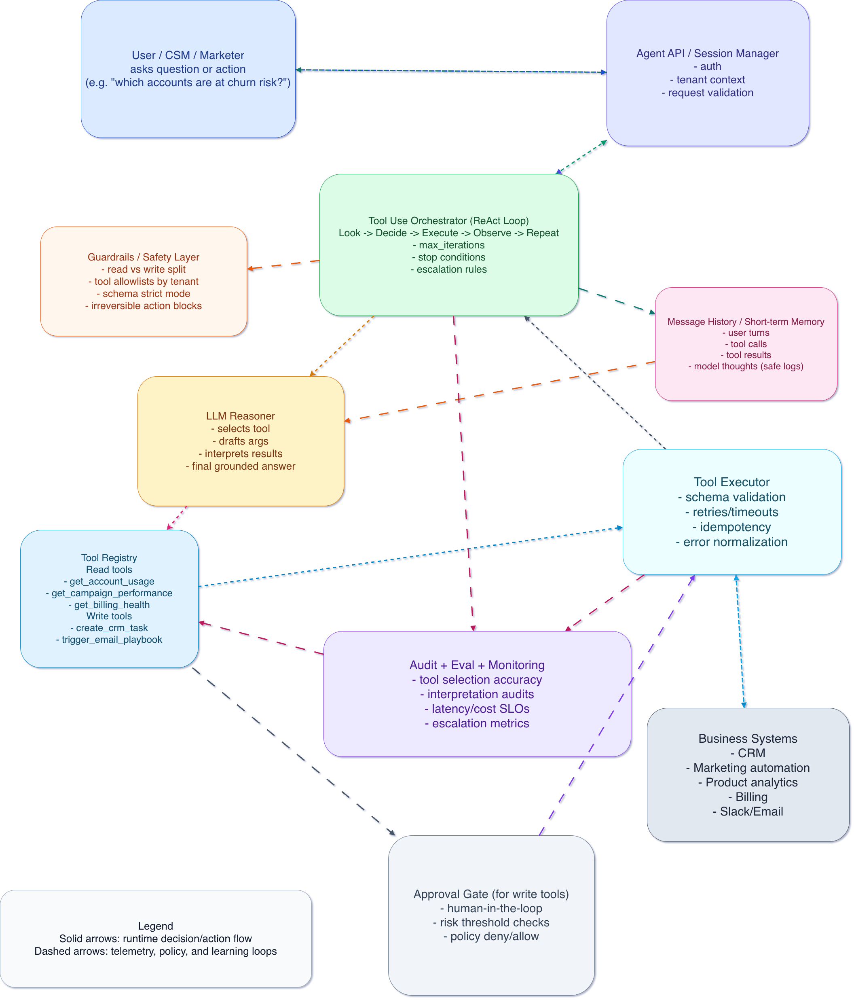

# Tool Use — The Evolutionary Thinking Document

**A complete guide from the foundational pattern to senior-engineer thinking**  
**Applied to B2B AI SaaS**

---

## Part 1: The Human Story — Where Tool Use Came From

For the first two years after ChatGPT, the entire world experienced LLMs the same way: **as a brilliant, articulate friend trapped behind glass.**

You could ask it anything. It would answer almost anything.  
**But it could not do anything.**

---

A founder of a B2B SaaS company would sit in front of GPT-4 and ask:

> “Which of my Pro-tier customers had declining usage last month?”

And the LLM — confidently, fluently, with perfect grammar — would **make up an answer**.  
Or it would say, “I don’t have access to your data.”

Neither response was useful.

The founder had **real customers**, **real usage logs**, and **real Stripe events**.  
The LLM had **words**.

There was a wall between them.

---

### The Wall

This wall was the most important problem in applied AI in 2022.

Every team building on top of LLMs hit it within their first week:

- **Customer support teams** → “The LLM can write the perfect refund email, but it cannot actually look up the order or issue the refund.”
- **Sales teams** → “The LLM can summarize a CRM entry beautifully, but only if I copy-paste it in — it can’t read Salesforce on its own.”
- **Internal ops teams** → “The LLM can draft a great Slack post about the deploy status, but it cannot check whether the deploy actually succeeded.”

**Every single B2B SaaS use case** ran into the same wall:  
**The LLM had reasoning but no hands.**

---

### The Breakthrough

The breakthrough came from two key developments:

1. The **ReAct** paper (Yao et al., 2022)
2. OpenAI’s **function calling** release shortly after

The insight was almost embarrassingly simple in hindsight:

> **Instead of asking the LLM to answer the question, ask it to decide which function should be called to get the answer.**

The LLM doesn’t need to know your customer’s MRR.  
It just needs to know that a function called `get_customer_mrr(customer_id)` exists — and when to call it.

**The function does the actual work.**  
**The LLM does the reasoning** — which function, with which arguments, in which order.

---

### The Wall Came Down

Suddenly the same LLM that could only *talk* about your B2B SaaS could now:

- Query your database
- Post to Slack
- Create Jira tickets
- Update HubSpot

**Tool Use** was the pattern that turned a chatbot into an agent.

And it remains **the foundational pattern** that every other agentic pattern builds on top of.


## Part 2: The Intuition Build

Imagine you’ve just hired a brilliant new product manager at your B2B SaaS company.  

**Day one.**  

She’s sharp — Stanford MBA, ex-McKinsey, talks about your market better than your founders do.  

You walk her into a meeting room and ask:  

> “Which of our enterprise customers are at risk of churning this quarter?”

She freezes.

Not because she doesn’t know how to *think* about churn — she knows the frameworks better than anyone.  

She freezes because she’s been at the company for **four hours**. She doesn’t have a Looker login. She can’t query the data warehouse. She doesn’t know which Slack channels the CSMs post in. She has no idea where the renewal forecast spreadsheet lives.

Her brain is full of **relevant thinking** and completely empty of **relevant facts** about your company.

---

### What Does She Do?

She doesn’t make up an answer.  

She turns to you and says:

> “Can you give me access to the usage dashboard?  
> And introduce me to whoever owns the renewals tracker?  
> And add me to the customer-success Slack channel?”

She is **asking for tools**.  

Specifically, she is asking for **the smallest set of tools** that will let her actually do the job you hired her to do.

She doesn’t ask for root access to production.  
She doesn’t ask to be added to every system.  

She asks for the **precise tools** that let her reasoning connect to your reality.

---

### Now Replace the PM with GPT-5

The model is just as smart.  
It also has **zero access** to your company’s reality.

The difference?  
**GPT-5 can’t ask for tools — you have to give them.**

---

### The Entire Game of Building Agents

The entire game of building an agent for your B2B SaaS company is exactly this:

> Figuring out **the smallest, sharpest set of tools** that lets the LLM’s reasoning connect to your business reality.

| Too Few Tools                  | Too Many Tools                          | **Just Right**                          |
|--------------------------------|-----------------------------------------|-----------------------------------------|
| Agent is articulate but useless | Agent gets confused, hallucinates actions, or picks wrong tool | Agent acts like your best PM — at scale, 3am, in 12 languages |
| Like the PM with no logins     | Risk of irreversible actions            | Precise leverage                        |

---

### The Core Intuition

**Tool Use** is not a technical trick.  

It is the pattern of giving an intelligent reasoner — one that has no hands — **a precisely chosen set of hands** that are useful in *your* specific business.

The formal name is **Tool Use**.  
The technical primitives are tool schemas, tool calls, tool execution, and the agent loop.  

But the underlying idea is the one you just felt in your gut:

> An intelligent reasoner that doesn’t have hands needs the right hands to become truly useful.


## Part 3: The Pattern Anatomy

### Part A — Plain Language Anatomy

A Tool Use system has **four moving parts**. Once you see them, you’ll recognize them in every agent you ever encounter:

1. **The LLM (The Reasoner)**  
   The brain that decides what to do next.

2. **The Tool Registry**  
   The list of functions the LLM is allowed to call. Each tool has a **name**, a clear **description**, and a **parameter schema** (what arguments it needs).

3. **The Executor**  
   The code that actually runs the chosen function when the LLM decides to call it.

4. **The Message History**  
   The running conversation log — what the user asked, what the LLM decided, what the tools returned, and what the LLM said next.

---

### How the Loop Works

The LLM looks at the user’s request + current message history → decides to call a tool (or answers if done) → the executor runs the tool → the result is appended to the history → the LLM thinks again.

**That loop — Look → Decide → Execute → Append → Repeat — is the entire pattern.**  
Everything else is just configuration.

---

### Part B — The Anatomy Table

| What the Pattern Is | What It Can Handle | What It Cannot Handle | What You’re Betting On |
|---------------------|--------------------|-----------------------|------------------------|
| An LLM that decides which external function to call, runs it, sees the result, and decides what to do next — **in a loop**, until it has an answer or hits a limit. | Tasks where the work needed is a **function call**: querying a database, calling an API, sending a notification, computing something deterministic, taking an action in a SaaS system. | • Tasks requiring complex multi-step planning over many dependencies (needs **Planning**)<br>• Tasks needing private knowledge not in a queryable system (needs **RAG**)<br>• Tasks where wrong outputs are catastrophic (needs **Reflection**) | That the LLM correctly understands each tool’s purpose from its description, picks the right tool at the right time, passes correct arguments, and knows when to stop. |

---

### Part C — How Tool Use Relates to the Four Core Patterns

**Tool Use is the foundational pattern.**  
It is not just *one* of the four — it is the **substrate** that the other three sit on top of.

| Pattern     | Relationship to Tool Use                                                                 | What It Really Is |
|-------------|-------------------------------------------------------------------------------------------|-------------------|
| **RAG**     | RAG is Tool Use where the tool is a retriever (`search_docs(query)`)                      | Specialized Tool Use + extra concerns around chunking & grounding |
| **Planning**| Planning adds a planner on top of Tool Use when multiple tools must be used in order     | Tool Use + deliberate sequencing |
| **Reflection** | Reflection is Tool Use where one of the tools is a critic/verifier LLM                   | Tool Use + self-critique capability |
| **Tool Use**| The core loop itself                                                                      | The foundation |

---

> In B2B AI SaaS, **every agent** you’ll ever build for a customer is a Tool Use system at its core — possibly wearing the costume of one of the other three patterns.

When you choose to build a “RAG agent”, “planning agent”, or “reflection agent”, you’re not picking between four different things.  
You’re deciding **how much structure to add** on top of the same foundational Tool Use loop.

**The quality of your tool design sets the ceiling for everything else.**

---

# Tool Use — The Evolutionary Thinking Document

**A complete guide from the foundational pattern to senior-engineer thinking**  
**Applied to B2B AI SaaS**

---

## Part 4: The Tool Design Choices

### Part A — Plain Language Explanation

The **single highest-leverage decision** in any Tool Use system is **what tools you give the agent** and **how you define them**.

Not the model.  
Not the framework.  
Not the prompt.  

**The toolset.**

---

Picture this:

You’re building an agent for a mid-market HRIS company called **PeoplePulse**. Their support team handles 4,000 tickets a month — “I can’t log in,” “Why was my employee charged twice?,” “How do I add a new department?,” “Cancel our subscription.”

You’re tasked with building an agent that resolves the first two categories without human intervention.

You sit down to define the tools. Two instincts pull at you:

- **Instinct 1 (Simple)**: Give the agent one powerful `query_database(sql_string)` tool and let the LLM write the SQL.  
- **Instinct 2 (Safe)**: Give it twenty narrow, named tools (`get_user_by_email`, `get_user_login_history`, `list_failed_payments_for_employee`, etc.).

**Both feel reasonable. Both are wrong — in different, expensive ways.**

---

**The single-tool disaster**:  
The LLM tries to help a customer who can’t log in and generates:  
`DELETE FROM users WHERE last_login IS NULL`  
→ 3,000 user accounts deleted.  
→ $400K liability cap is about to be tested.

**The twenty-tool disaster**:  
Tool descriptions balloon to 6,000 tokens. Tool selection accuracy drops to 71%. The agent confidently calls the wrong lookup function and gives incorrect answers.

**Tool design is not a generic engineering decision.**  
**It is a business decision dressed up as engineering.**

---

### Part B — Why These Design Dimensions Matter

Tool Use emerged with very specific design knobs because each one corresponds to **real business risk** that teams discovered in 2023–2024 production deployments:

- **Granularity** (one tool vs many) → LLMs fail with overly generic tools  
- **Read vs Write separation** → Wrong writes are orders of magnitude more expensive  
- **Approval gates** → Some actions are too irreversible for “the LLM decided”  
- **Schema strictness** → Free-form parameters lead to hallucinated fields  

These are not theoretical. They are **scar tissue** from a thousand B2B SaaS production incidents.

---

### Part C — Thinking Framework #2 Applied

```markdown
THINKING FRAMEWORK #2 APPLIED TO TOOL USE:

Every tool is a hypothesis — know its limitations before you give it to the agent.

In B2B AI SaaS, every tool you give the agent is a hypothesis with 
a contractual and reputational price tag attached.

When you give the agent `issue_refund(amount)` without an approval gate, 
you are betting that the LLM will correctly interpret refund eligibility.

When you give it a generic `update_customer_record(fields)` tool, 
you are betting it will only change what the user asked for — not seven other fields it “noticed could probably be updated.”

Each tool’s existence is a bet.

And in B2B SaaS, your bets are visible: they appear in audit logs, compliance reports, 
and ARR-impacting incidents that escalate from your customer’s CTO to your CEO.

```

```
B2B SaaS default bias: Narrow, named, read-mostly tools with explicit approval gates on writes.

Never accept the template “give the agent these 20 tools and let it figure it out.”

For every tool, force yourself to answer:

(a) Worst-case if called with wrong arguments?
(b) Is the worst-case reversible automatically or does it need human cleanup?
(c) Does the customer’s contract actually allow this action without a human?

If you can’t answer those three questions, you don’t have a tool design — you have a liability surface.
```

### Part D — Reality Check

REALITY CHECK

If you ignore this concept:

• You ship an agent with a generic run_sql tool.  
  Three weeks later it runs a query that locks the production payments table 
  for 18 minutes during peak hours.  
  Your customer’s CTO is in your Slack at midnight asking why your “AI feature” 
  took down their billing.

• You ship twenty similar narrow tools.  
  Tool selection accuracy = 78%.  
  The agent confidently mixes up billing and user data.  
  Customers don’t notice for weeks.  
  On the renewal call the question isn’t “can you fix it?” — 
  it’s “how do we know what else was wrong?”


```markdown

The wrong toolset doesn’t make your agent fail obviously.
It makes your agent fail with full confidence and clean log lines saying “tool call succeeded.”
In B2B SaaS, the customer usually finds out before you do.

```

## Part 5: The Coordination / Control Flow

**This is where Tool Use reveals its true nature.**

It has the **simplest control flow** of any agentic pattern — and that simplicity is both its greatest strength and its most underestimated trap.

---

### The Tool Use Loop (Plain Language)

1. User sends a message.  
2. The LLM looks at the message + available tools + message history.  
3. The LLM does one of two things:  
   - **(a)** Decides to call a tool → Executor runs it → Result is appended to history → Go back to step 2.  
   - **(b)** Decides it has enough information → Produces a final answer for the user.

**No upfront plan.**  
**No critic.**  
**No decomposition.**  

Just: *Look → Decide → Act → Observe → Repeat.*

This is the canonical **ReAct loop** (Reasoning + Acting). Every major framework — LangChain, LlamaIndex, Anthropic tool use, OpenAI function calling — implements some version of it as the default.

---

### How It Compares to Other Patterns

**Tool Use is the baseline.**  
It is the trunk. Everything else is a branch.

| Pattern      | How It Modifies the Tool Use Loop                  | When It Adds Value |
|--------------|----------------------------------------------------|--------------------|
| **Tool Use** | Pure reactive loop (ReAct)                         | Simple, scoped tasks |
| **RAG**      | Inserts a retrieval step before reasoning          | Knowledge-heavy queries |
| **Planning** | Adds an upfront decomposition / roadmap step       | Multi-step dependencies |
| **Reflection**| Adds a critique / verification step before final answer | High-stakes accuracy |

---

### The Reactive Nature — The Insight Most Engineers Miss

The loop is **purely reactive**.

The LLM never says:  
> “To solve this, I will call Tool A, then Tool B, then Tool C.”

It only ever says:  
> “Given everything I see **right now**, the next best action is X.”

After X finishes, it looks at the new state and decides again.

**This works beautifully for short, obvious tasks** — e.g., “What’s the MRR for Acme Corp?” (one tool call → done).

**It breaks down on tasks with hidden dependencies** — e.g., “For our top 10 churning customers, summarize their support tickets and flag any mentioning competitors.” The agent can lose track of the original goal, run out of context, or skip key analysis.

---

### Thinking Framework #5 Applied to Tool Use

```markdown
THINKING FRAMEWORK #5 APPLIED TO TOOL USE:

Planning is the universal coordinator, but its variants matter enormously.

Tool Use sits at the "no plan" end of the spectrum. 
This is a deliberate choice — not a missing feature.

Question for every B2B SaaS use case: 
Is "no plan" the right variant for this customer’s task?


Examples from PeoplePulse (HRIS):

“I can’t log in” → Pure Tool Use (no plan) is perfect. Two tool calls, clear path.
“Why was my employee charged twice?” → No-plan starts failing due to hidden dependencies. Better to use a static plan (clarify run → pull data → identify duplicates).

Recommended Variants in B2B SaaS:

No plan (pure Tool Use): Scoped, predictable tasks
Static plan upfront: Tasks with stable but hidden ordering
Replanning on failure: Tasks with flaky tools or messy data

Hierarchical planning is almost always overkill for single-workflow B2B agents.

Failure Modes Specific to Tool Use
Because the loop is reactive and has no built-in plan, three characteristic failures appear:

Infinite Looping
Agent keeps calling the same tool with the same arguments.

Premature Stopping
Agent calls one tool, gets a partial result that looks complete, and answers the user anyway.

Tool Confusion
Calls get_user_account when it needed get_billing_account because descriptions overlap.

Diagnostic Trick (Production Gold):
Print the full message history of a failing run. Read it as if you were the LLM. If you would have made the same decision, the problem is almost never the model — it’s in tool descriptions, granularity, or stopping conditions.

```

## Part 6: All 13 Thinking Frameworks Applied to Tool Use

This is the centerpiece. Each framework, applied specifically to Tool Use, with an explicit judgment of how it relates to the foundational pattern map. We'll do frameworks 1–4 first, then pause.

### THINKING FRAMEWORK #1: Pattern selection is the highest-leverage skill

**Core insight:** The most important decision in any agent project happens before you write a prompt — which patterns does this problem actually need?

**Applied to Tool Use:**  
For Tool Use specifically, the pattern selection question becomes inverted.  
Instead of asking "should I use Tool Use?", you ask "is Tool Use *enough*?"  
Because Tool Use is the foundational pattern, you almost always need it. The real question is whether to add Planning, RAG, or Reflection on top. In B2B AI SaaS, the temptation is to start with all four because the customer's use case "feels complex" — but most B2B SaaS workflows are actually two-to-four tool calls with no hidden dependencies, and pure Tool Use ships in a week while a four-pattern composition takes a quarter. The senior move is to ship pure Tool Use to your design partner first, watch where it specifically fails, then add exactly the pattern that addresses the specific failure. Don't add Reflection because "errors might be costly" — add it because you saw the agent confidently miscategorize a churn signal in week 2 of the pilot.

**Compared to the four core patterns:**  
[X] Identical — works exactly the same way

Pattern selection thinking is identical for Tool Use as for any other pattern.  
The framework is: start with the minimum viable architecture (which for most B2B SaaS workflows is pure Tool Use), and add structural complexity only when you've seen the specific failure that justifies it. This is the same discipline the session document urged — and it applies most strictly to Tool Use because Tool Use is the easiest pattern to over-engineer.

### THINKING FRAMEWORK #2: Every tool is a hypothesis — know its limitations before you give it to the agent

**Core insight:** Each tool you give an agent is a bet that the LLM will use it correctly; tool granularity is a tradeoff between capability and safety.

**Applied to Tool Use:**  
This framework is *most* important for Tool Use because Tool Use *is* tools. There's no other layer to compensate for bad tool design — no planner that will spot the wrong tool choice, no reflector that will catch the wrong argument. In pure Tool Use, the toolset is the agent. For B2B AI SaaS, this means tool design isn't a sub-task of building the agent — it *is* building the agent. When you sit down with PeoplePulse to scope the support agent, the two-week tool design conversation is the project. The prompt engineering, the LLM selection, the framework choice — those are an afternoon each. The tool schemas, the granularity decisions, the approval gates, the reversibility analysis — that's the work. If you find yourself spending 80% of project time on prompts and 20% on tool design in a B2B SaaS engagement, the project is upside-down and will fail in production.

**Compared to the four core patterns:**  
[X] Fundamentally different — and here is why that matters:

In RAG, the analogous framework is about retrieval pipeline design — and you have grounding checks (citations, source attribution) as a backstop. In Planning, you have the plan structure as a sanity check. In Reflection, the critic catches some tool-use mistakes. In *pure* Tool Use, there is no backstop. The tool design *is* the system's correctness model. This is why Framework #2 carries more weight in Tool Use than in any other pattern, and why senior B2B SaaS engineers spend disproportionate time on tool schemas, naming, and granularity. A 2% tool-selection error rate is fine on a personal assistant. On a B2B SaaS contract, it's a renewal risk.

### THINKING FRAMEWORK #3: The retrieval pipeline is a business decision, not a technical one

**Core insight:** Different retrieval choices produce different business outcomes from the same documents.

**Applied to Tool Use:**  
Pure Tool Use doesn't have a retrieval pipeline — but it has the analog: the **tool registry** as a business decision. Which tools to include, which to omit, which to gate, which to expose to which customer tier. In B2B AI SaaS, the tool registry is contractually significant. A customer on your "Standard" tier might get an agent with read-only tools. A customer on "Enterprise" might get write tools with their internal approval workflow integration. A customer in a regulated vertical (FinServ, HealthTech) might get a tool registry that explicitly excludes anything that could touch PHI or PII without their MFA gate. This isn't engineering work — it's product work. Your customer success team and your security team need to be in the room when the tool registry is defined per tier.

**Compared to the four core patterns:**  
[X] Similar — same principle, different execution

The principle is identical: the configuration of how the agent connects to information/action is a business decision. In RAG it's the chunking and retrieval pipeline. In Tool Use it's the tool registry composition. In both cases, the worst failure mode is engineers making the choice based on technical convenience instead of business risk. The execution differs because tools are usually fewer than chunks (10–30 vs millions) and the decisions are discrete rather than statistical. But the framework is the same: business people in the room, business risks documented per choice.

### THINKING FRAMEWORK #4: The universal agent architecture — Tool Use, RAG, Planning, Reflection

**Core insight:** Every agent ever built combines some subset of the same four primitives.

**Applied to Tool Use:**  
Tool Use is the *foundation* of this framework — the primitive on which the other three sit. A "RAG agent" is Tool Use where one tool is a retriever. A "Planning agent" is Tool Use with a planner deciding the next action. A "Reflection agent" is Tool Use plus a critic LLM that re-reads the output. For B2B AI SaaS strategy, this matters because when a sales prospect says "we want a planning agent," they almost always mean "we want Tool Use that handles a multi-step workflow." The label is wrong; the underlying need is Tool Use with a small planning layer. Translating customer language ("AI agent," "AI assistant," "Copilot," "Workflow agent") into the four-pattern map is a senior-engineer skill that prevents you from over-architecting based on customer terminology.

**Compared to the four core patterns:**  
[X] Fundamentally different — and here is why that matters:

Tool Use is the foundation, not a peer. The other three patterns are extensions of the Tool Use loop, not alternatives to it. When you build any non-Tool-Use agent, somewhere inside it there is a Tool Use loop doing the actual work. This means: master Tool Use first, deeply, and the other three patterns become "Tool Use with extra structure" rather than three separate things to learn. Engineers who try to learn all four patterns simultaneously usually end up with a shallow understanding of all four. Engineers who deeply master Tool Use first absorb the other three in a fraction of the time.

### THINKING FRAMEWORK #5: Planning is the universal coordinator, but its variants matter enormously

**Core insight:** No-plan, static plan, replanning, hierarchical — the variant choice matters as much as having a plan at all.

**Applied to Tool Use:**  
Pure Tool Use is the "no plan" variant — and that's a deliberate choice with specific consequences. For B2B AI SaaS, the no-plan variant works for predictable, scoped customer workflows: log-in unlock, MRR lookup, invoice download, single-record updates. The moment a customer's workflow has "and then if X, do Y, else do Z" — even just one branch — pure Tool Use starts producing inconsistent results across runs. Senior engineers learn to spot the inflection point: when your eval set shows the agent succeeding on simple tickets and failing on tickets that require any conditional logic, that's the signal to add a static plan. Not a hierarchical plan. Not full replanning. Just a static plan that names the steps. Most B2B SaaS workflows don't need more.

**Compared to the four core patterns:**  
[X] Similar — same principle, different execution

The principle that variants matter is identical across patterns. In Reflection, the variant choice is self vs cross-model vs tool-grounded. In RAG, it's dense vs sparse vs hybrid. In Tool Use's planning dimension, it's no-plan vs static vs replanning. The execution differs because Tool Use's "no plan" default is more often correct than other patterns' defaults — because most B2B SaaS individual workflows are short. But the discipline of explicitly choosing the variant rather than defaulting is the same.

### THINKING FRAMEWORK #6: The composition vs complexity tradeoff defines senior agent engineers

**Core insight:** When a single-pattern agent fails, you can either add complexity to the existing agent or compose multiple agents/patterns.

**Applied to Tool Use:**  
For Tool Use systems in B2B AI SaaS, this framework shows up as the "toolset bloat" decision. You have a Tool Use agent with 8 tools handling support tickets. The customer wants it to also handle billing inquiries. You have two options: add 6 billing tools to the same agent (now 14 tools, prompt accuracy starts to degrade), or compose two specialized agents — a router that decides "support ticket vs billing inquiry" and dispatches to a support-Tool-Use-agent or a billing-Tool-Use-agent. The composition move is almost always right when the tool sets don't naturally overlap. The complexity move is right when the tools share a domain and removing them would create artificial seams. The senior judgment is recognizing which is which — and the tell is whether your support agent and billing tools share customers, share entities, share auth contexts. If yes, keep them in one agent. If no, compose.

**Compared to the four core patterns:**  
[X] Identical — works exactly the same way

The composition vs complexity tradeoff applies the same way to Tool Use as to any other pattern. The cue is identical: when in doubt, lean toward composing simpler agents rather than building one giant agent. The trap is identical: junior engineers add tools to an existing agent because it feels faster than building a new one, until the agent has 25 tools and 60% tool-selection accuracy.

### THINKING FRAMEWORK #7: Hallucination is the silent killer

**Core insight:** Confident wrong answers are indistinguishable from correct ones without verification.

**Applied to Tool Use:**  
Tool Use has a specific hallucination signature that's worth memorizing because it differs from the RAG hallucination pattern. In RAG, the LLM hallucinates content that wasn't in the retrieved chunks. In Tool Use, the LLM hallucinates **tool call arguments** and **tool call interpretations**. A pure Tool Use agent for PeoplePulse might call get_user(email="actual_email") correctly, get back {"status": "active", "last_login": "2024-11-03"}, and then tell the user "your account is active and you logged in last week" — when "last week" is a hallucinated interpretation of a date the LLM didn't actually parse correctly. The tool call was right. The tool result was right. The *interpretation* of the result is wrong. This is harder to catch than RAG hallucination because there's no missing source to point at — the source is right there in the message history. The fix is reflection that re-reads tool results and verifies the LLM's interpretation matches the actual data.

**Compared to the four core patterns:**  
[X] Fundamentally different — and here is why that matters:

In RAG, hallucination is "the LLM made up a fact that wasn't retrieved." In Tool Use, hallucination is "the LLM correctly retrieved a fact and then mis-stated it." This matters because the verification strategy is different. RAG hallucination is caught by checking claims against retrieved chunks. Tool Use hallucination is caught by checking claims against tool **results in the message history**. The audit pattern is different. In B2B SaaS this matters because the audit trail looks clean — the tool call succeeded, the result is logged — but the customer-facing answer is wrong. Diagnosing this requires reading the LLM's interpretation, not just verifying the tool ran.

### THINKING FRAMEWORK #8: How you ground answers matters as much as that you ground them

**Core insight:** The grounding strategy — sources, tool-grounded numbers, verified citations — matters as much as the existence of grounding.

**Applied to Tool Use:**  
For pure Tool Use, grounding means the agent's answer should be traceable back to specific tool calls and specific tool results. In B2B AI SaaS, this becomes a customer-facing feature. PeoplePulse's CSM asks the agent "is Acme Corp at risk of churning?" and the agent should answer with "Yes, because [tool call: get_usage_metrics returned 60% drop] and [tool call: get_support_tickets returned 4 escalations in the last month]." Not "yes because they seem at risk." The tool-grounded answer is auditable; the ungrounded answer is the start of an incident. This matters more in B2B than B2C because B2B customers will literally ask, in writing, "show me the data this conclusion is based on" — and the answer needs to be in the agent's response, not in your engineers' Sentry logs.

**Compared to the four core patterns:**  
[X] Similar — same principle, different execution

The principle is identical: grounding is mandatory and the grounding strategy is a first-class design decision. The execution differs because Tool Use grounds answers in tool results (structured data, exact values) rather than retrieved text chunks. This is actually a *cleaner* grounding model — exact numbers and structured fields are easier to cite than paragraph excerpts. B2B SaaS Tool Use systems should lean into this: every customer-facing claim should be expressible as "this came from tool X's result Y."

### THINKING FRAMEWORK #9: Reflection is universal — but what kind of correctness do you need?

**Core insight:** Self / cross-model / tool-grounded / multi-aspect — match the variant to the stakes.

**Applied to Tool Use:**  
Pure Tool Use ships without reflection. That's the definition. The question this framework forces in B2B AI SaaS is: when does the customer's risk profile mean pure Tool Use is irresponsible to ship? The answer is rarely "never" — most B2B SaaS Tool Use agents ship without reflection in their first version because reflection doubles latency and most v1 use cases are read-mostly. But the threshold is specific: the moment the agent gets write tools with customer-visible consequences (sending emails to end-users, updating customer-facing records, triggering workflows in the customer's other systems), pure Tool Use becomes a liability and reflection becomes non-optional. The variant for B2B SaaS write-tool reflection is almost always tool-grounded reflection: the critic re-reads the tool calls and asks "given the user's original request, do these tool calls match the intent and only the intent?" Multi-aspect reflection is overkill for most B2B SaaS Tool Use until you're in a regulated vertical.

**Compared to the four core patterns:**  
[X] Fundamentally different — and here is why that matters:

In RAG, reflection checks generation against retrieved evidence. In Planning, reflection checks step outputs against plan requirements. In Tool Use, reflection has a unique form: it checks the *match between user intent and tool call sequence*. The question isn't "is the answer factually correct" (the tools are the source of truth) — it's "did the agent do what the user actually asked, or did it do something adjacent that the LLM thought was better?" This intent-fidelity check is the form of reflection most specific to Tool Use, and it's the one most missed by engineers who think reflection is just "have another LLM grade the output."

### THINKING FRAMEWORK #10: Report business metrics, not just technical ones

**Core insight:** Stakeholders make decisions on rupee impact, not tool call accuracy.

**Applied to Tool Use:**  
For B2B AI SaaS Tool Use systems, the stakeholder is your customer's decision-maker — usually a VP or C-level — and the metric they renew on is not tool-call accuracy. It's "how many of my support tickets did this resolve without my team touching them?" or "how much CSM time did this save in QBR prep?" The technical metrics — tool selection accuracy, average tool calls per task, tool execution success rate — are for your team's internal debugging. The business metrics for customer reporting are: deflection rate (% of tickets resolved without human escalation), time-to-resolution improvement vs baseline, and dollar-cost saved per customer per month net of any error remediation. The bridge metric — the one both sides care about — is escalation rate, because high escalation rate means the agent isn't deflecting work and the customer is paying you to make their support team's job harder.

**Compared to the four core patterns:**  
[X] Identical — works exactly the same way

This framework is identical across all four patterns. The discipline is the same: technical metrics for internal use, business metrics for stakeholder reporting, and a clear translation between them. The trap is identical: engineers reporting tool selection accuracy to a VP who doesn't care about tool selection. The fix is identical: every customer dashboard shows the business metrics; the technical metrics live in your engineering Notion.

### THINKING FRAMEWORK #11: The best tools come from domain workflows, not technical generalizations

**Core insight:** Tools should mirror the verbs the human team uses today.

**Applied to Tool Use:**  
This is the single most important framework for Tool Use system design, and the one B2B AI SaaS engineers under-invest in most. The right way to design a tool registry for PeoplePulse's support agent is to sit with three of their support reps for two days and watch them work. Note every action they take: "I look up the user by their work email," "I check their last login event," "I check whether their company's SSO is misconfigured," "I issue a password reset and ping their IT admin." Those verbs become your tools. `get_user_by_work_email`. `get_last_login_event`. `check_sso_health`. `issue_password_reset_and_notify_admin`. The tools mirror the workflow, which means the LLM (which is good at language) can map customer intent to tool selection naturally. The wrong way is to design tools by looking at PeoplePulse's database schema or API surface — that gives you tools that match their data model, not their workflow, and the LLM has to translate between two different ontologies on every call.

**Compared to the four core patterns:**  
[X] Identical — works exactly the same way

Domain workflow grounding applies identically to all four patterns. In RAG, chunking and retrieval should match how domain experts find information. In Planning, plan structure should match how experts decompose tasks. In Reflection, the critic's checklist should match what an expert reviewer would check. The principle is the same: ground the agent in what the human team actually does, not in technical abstractions. The execution differs only in which artifact gets the workflow grounding (tools, chunks, plans, checklists).

### THINKING FRAMEWORK #12: Violated assumptions give you confidently wrong agents

**Core insight:** Agents with violated assumptions can complete tasks "successfully" while doing exactly the wrong thing.

**Applied to Tool Use:**  
Tool Use carries a specific set of assumptions worth naming because they're distinct from RAG/Planning/Reflection assumptions. (1) The LLM correctly understands each tool's description. (2) The LLM correctly maps user intent to tool selection. (3) Tool descriptions are unambiguous enough that two similar tools don't get confused. (4) Tool results are interpretable by the LLM in their raw form. (5) The user's intent is fully captured in their initial message, so the agent doesn't need to ask follow-ups. Every one of these assumptions gets violated regularly in B2B AI SaaS production. The diagnostic for each is concrete: (1) tool selection accuracy on a labeled eval set; (2) intent-tool mapping audit on real conversations; (3) tool-pair confusion matrix for similar-named tools; (4) check whether tool results contain encoded data (timestamps, IDs, JSON-in-strings) the LLM might mis-read; (5) count of conversations where the agent acted before clarifying intent and got it wrong.

**Compared to the four core patterns:**  
[X] Fundamentally different — and here is why that matters:

Each pattern has its own assumption set. RAG assumes retrieval surfaces the truth. Planning assumes plans stay valid through execution. Reflection assumes the critic's blind spots differ from the generator's. Tool Use assumes the tool descriptions encode meaning unambiguously. In B2B SaaS, this matters because the *audit* differs per pattern. You don't audit a Tool Use system the same way you audit a RAG system. The Tool Use audit is focused on tool selection and tool-result interpretation. Confusing the audits — running RAG-style hallucination checks on a Tool Use system — catches some but misses the Tool-Use-specific failure modes.

### THINKING FRAMEWORK #13: The pipeline is universal, but the gotchas at each stage are where projects die

**Core insight:** Step limits, audit logs, escalation paths — the boring infra is where reliability lives.

**Applied to Tool Use:**  
Tool Use has its own gotcha list at each pipeline stage, and B2B AI SaaS projects die on these specifically. Problem definition stage: "we need a Tool Use agent" when 60% of the workflow is deterministic if-this-then-that that doesn't need an LLM. Pattern selection: defaulting to pure Tool Use when the task has dependencies that need a planning step. Tool design: the gotcha list is the longest — generic tools, ambiguous descriptions, no approval gates on writes, no schema validation, missing reversibility analysis. Knowledge engineering doesn't apply (no retrieval). Prompt design: no max-iterations limit (the agent loops forever), no stopping condition ("when do I stop calling tools and answer?"), no refusal policy for out-of-scope requests. Evaluation: only testing happy-path tool calls, missing the adversarial cases where users provide malformed inputs or ambiguous intent. Deployment: no per-tool-call audit log (so when something goes wrong you can't reconstruct the decision sequence), no escalation path for low-confidence cases, no kill switch for individual tools when they start failing.

**Compared to the four core patterns:**  
[X] Identical — works exactly the same way

The pipeline is universal and so is the principle that each stage has its own gotchas. The gotcha *content* differs per pattern, but the discipline of running the pipeline-stage-by-stage is identical. For B2B AI SaaS Tool Use, the gotchas that kill projects most often are at the prompt design stage (missing limits) and deployment stage (missing audit infra) — because these stages get treated as engineering hygiene rather than as core correctness infrastructure. They are core correctness infrastructure.

## Part 7: AI Coding Agent Moments for Tool Use

These are the specific decision points in any B2B AI SaaS Tool Use project where the framework or coding agent cannot make the call alone. They need your domain knowledge, your customer's risk profile, and your strategic judgment. Each prompt is pasteable directly into Claude or any coding agent — no editing required.

### AI CODING AGENT MOMENT #1: Tool granularity decision for the customer's risk profile

**Why the framework cannot do this alone:**  
A coding agent doesn't know your customer's contractual liability cap, doesn't know which actions are reversible by their internal automation vs require manual cleanup, and doesn't know which tools their security team would refuse to approve in a SOC2 audit. The default the framework would generate — "give the agent these 12 tools and let the LLM choose" — works for personal projects and fails for B2B SaaS contracts.

**What an expert tells the agent:**

> "For our customer PeoplePulse (mid-market HRIS, ~800 enterprise customers, $45M ARR), we are designing the tool registry for their support agent.
>
> Before generating any tool schemas, build me this analysis as a table:
>
> For each candidate tool, I need:  
> 1. The tool name and a 1-line description  
> 2. Read-only or write? If write, what entities does it mutate?  
> 3. Reversibility: automated rollback possible / manual cleanup required / irreversible?  
> 4. Worst-case business impact if the LLM calls it with wrong arguments (in dollars or in 'customer-visible incident severity')  
> 5. Should this require human approval before execution? If yes, what's the approval mechanism (Slack, email, in-app)?  
> 6. Customer-tier gating: which contract tiers should have access? (Standard / Pro / Enterprise / regulated-vertical-only)
>
> Candidate tools to analyze:  
> - get_user_by_email  
> - get_user_login_history  
> - check_sso_configuration  
> - reset_user_password  
> - unlock_user_account  
> - get_company_subscription_status  
> - list_failed_payments  
> - issue_refund  
> - update_billing_email  
> - create_support_ticket  
> - escalate_to_human_csm
>
> Do NOT generate tool schemas yet. I need the analysis table first.  
> After I review and adjust the table, we'll generate schemas only for the tools that pass the analysis — and for write tools, we'll generate the approval-gate code paths separately."

**REALITY CHECK**  
If you ignore this concept:  
- The coding agent generates 11 tool schemas in one go. You ship them. Three weeks later, the agent issues a $4,200 refund to a customer who asked about a $42 charge — the LLM passed the wrong argument and there was no approval gate. Your customer's CFO is on the phone with your CEO.  
- The agent has read tools and write tools mixed in the same registry with no tier gating. A Standard-tier customer (not contractually entitled to automated writes) gets write actions executed against their data. SOC2 audit finding. Renewal at risk.

**Tool granularity is a contract-level decision.** The framework will execute whatever you give it.

---

### AI CODING AGENT MOMENT #2: Stopping condition design for the agent loop

**Why the framework cannot do this alone:**  
The default ReAct-style agent loop has no inherent stopping condition beyond "the LLM stops calling tools." The LLM's judgment of "I'm done" is shaped by the system prompt. A coding agent generating boilerplate won't know your B2B SaaS use case's specific signals for "the agent has enough information to answer" or "the agent should escalate to human" — those are domain decisions, not framework defaults.

**What an expert tells the agent:**

> "For PeoplePulse's support agent, the default 'LLM decides when to stop' behavior is wrong for our use case. Build the stopping logic explicitly.
>
> The agent should stop and respond to the user when ANY of these are true:  
> 1. The agent has called all tools needed to answer the user's exact question AND the answer is fully grounded in tool results  
> 2. The agent has called 8 tools without converging on an answer (max_iterations safety stop)  
> 3. The agent encounters a tool error twice in a row on the same tool (probable infrastructure issue, escalate)  
> 4. The user's intent is ambiguous and the agent has identified TWO or more plausible interpretations (ask for clarification, do not guess)  
> 5. The action required would be a write tool but the user's eligibility for that action is unclear (escalate to human CSM)  
> 6. The agent is about to issue a customer-visible communication (email, in-app message) — pause for human approval regardless of confidence
>
> For each stop condition, specify:  
> - The detection logic (what in the message history triggers it)  
> - The user-facing response template  
> - Whether it counts as 'resolved by agent' or 'escalated' in our metrics  
> - Whether it should log a specific audit event for our customer's compliance team
>
> The system prompt should explicitly instruct the LLM about conditions 1, 4, and 5. Conditions 2, 3, and 6 should be enforced in the orchestration code, NOT trusted to the LLM. Show me the prompt section and the orchestration code separately."

**REALITY CHECK**  
If you ignore this concept:  
- The agent loops 23 times on a malformed customer question, racks up $14 in API cost on a single ticket, and eventually returns "I'm sorry, I couldn't help" — after eight minutes of latency. Customer churns.  
- The agent decides on its own to send a customer-visible email confirming a subscription change it inferred from context. The change wasn't what the customer wanted. The email is now in the customer's audit log.

**Stopping conditions are correctness infrastructure, not engineering hygiene.**

---

### AI CODING AGENT MOMENT #3: Tool description disambiguation for similar tools

**Why the framework cannot do this alone:**  
A coding agent will generate tool descriptions that *sound* clear in isolation. The failure mode is when the agent has 4 tools that all sound plausible for a given user intent — get_user_account, get_customer_account, get_billing_account, get_organization_account — and the LLM picks the first plausible match. Disambiguating these requires understanding how your customer's domain actually distinguishes the entities, which the coding agent doesn't know.

**What an expert tells the agent:**

> "The current tool registry has these four lookup tools and the LLM is confusing them in production (tool selection accuracy on this category is 67% on our eval set):
>
> - get_user_account  
> - get_customer_account  
> - get_billing_account  
> - get_organization_account
>
> For PeoplePulse's domain, here is the actual entity model:  
> - A 'user' is an individual employee at one of PeoplePulse's customers  
> - A 'customer' is the company that pays PeoplePulse (e.g., 'Acme Corp')  
> - A 'billing account' is the financial record attached to a customer (one customer can have multiple billing accounts for different divisions)  
> - An 'organization' is a container for multiple customers under a parent company (e.g., 'Acme Holdings' contains 'Acme Corp' and 'Acme EU')
>
> Rewrite each tool's description so that:  
> 1. The first sentence explicitly contrasts it with the other three tools ('Use this when you need X, NOT when you need Y or Z')  
> 2. The parameter names use domain-specific vocabulary, not generic 'id' (employee_email_or_id, customer_company_name_or_id, etc.)  
> 3. Each description includes ONE example of correct use AND ONE example of a wrong use that previously caused confusion  
> 4. The description ends with 'If the user said [these phrases], use this tool. If they said [these phrases], use [other tool] instead.'
>
> Then, generate a 30-question eval set specifically targeting the boundary cases between these four tools — questions where a junior engineer might pick the wrong one. Run it before we redeploy."

**REALITY CHECK**  
If you ignore this concept:  
- A CSM asks the agent about Acme Corp's billing. Agent calls get_user_account with 'Acme Corp' as the parameter, gets back null, tells the CSM "no record found." The CSM concludes Acme Corp isn't a customer. Acme Corp is in fact a customer — the agent just called the wrong lookup.  
- Tool selection accuracy stays at 67% across all four lookups. Your customer's team builds workarounds: prefixing every question with "in our billing system, ..." to nudge the LLM. The agent's UX degrades into a constrained command language. The "AI" loses its value proposition.

**When tools sound similar, the LLM will mix them.** Disambiguation is a description-engineering problem, not a model problem.

---

### AI CODING AGENT MOMENT #4: Tool result interpretation audit

**Why the framework cannot do this alone:**  
The framework wires up tool calls and tool results correctly. What the framework can't catch is when the LLM mis-interprets a structurally correct tool result — reading a timestamp wrong, mis-counting items in a list, mis-parsing a status enum. The audit for this is specific and not in any framework's defaults.

**What an expert tells the agent:**

> "Build a tool-result-interpretation audit for the support agent. We suspect the LLM is mis-reading some tool results.
>
> For 100 random conversations from last week's logs:
>
> 1. For each tool call in the conversation, extract:  
>    - The tool name and arguments  
>    - The full tool result (raw)  
>    - The agent's next message that referenced the tool result
>
> 2. For each (tool result, agent message) pair, classify:  
>    - FAITHFUL: agent's message accurately reflects the tool result  
>    - DROPPED: agent's message ignored important fields in the result  
>    - MIS-PARSED: agent's message states something contradicted by the result  
>    - INTERPRETED-PLAUSIBLY: agent added inference not in the result, but the inference is reasonable  
>    - INTERPRETED-WRONGLY: agent added inference not in the result, and the inference is wrong
>
> 3. For each tool, report the distribution. Tools with >5% MIS-PARSED or INTERPRETED-WRONGLY need their result format reworked.
>
> 4. For tools with high mis-interpretation rates, propose:  
>    - Result format changes (flatten nested JSON, expand enums to full text, pre-compute derived fields)  
>    - Description additions ('the field X is in seconds, not milliseconds')  
>    - Whether to add a result-summary tool that the LLM calls on the result before using it
>
> This is not a one-time audit. Schedule it weekly in production. Surface the results to the engineering team in a dashboard."

**REALITY CHECK**  
If you ignore this concept:  
- The 'last_login' field in your tool result is a Unix timestamp. The LLM reads it as '1698732847' and tells the customer 'your last login was in the year 1698.' Customer assumes the agent is broken.  
- The 'status' enum returns 'PARTIAL_REFUND_PENDING_APPROVAL'. The LLM shortens this to 'refund pending' in its response. Customer reads 'refund pending' as 'refund will arrive soon' and waits a week before realizing it required their CFO's approval that no one requested.

**Tool calls succeeding doesn't mean tool *answers* are correct.** Audit interpretation, not just execution.


## Part 8: Real-World Framing Examples for B2B AI SaaS

Three detailed scenarios where Tool Use is the right pattern choice for a B2B AI SaaS use case. Each scenario shows the naive framing, the strategic framing, the success metric in business terms, and the framing trap to avoid.

### Scenario 1: The CSM Quarterly Business Review (QBR) Prep Agent

**The business question:**  
A B2B AI SaaS company sells to enterprise customers, each managed by a Customer Success Manager (CSM). Every quarter, each CSM prepares a QBR deck for their accounts — pulling usage data from the product analytics tool, support history from Zendesk, billing health from Stripe, and sentiment signals from recent Gong call transcripts. A CSM with 25 accounts spends ~30 hours per quarter on this. The Head of CS asks: "Can we build an AI agent that produces a draft QBR brief per account in under 5 minutes, so my CSMs spend their time on strategy instead of data gathering?"

**The naive framing most people would use:**  
"This is obviously a RAG project — we have all this customer data, let's embed everything and have the LLM retrieve it." A junior engineer builds a vector store of usage logs, support tickets, billing records, and call transcripts. The agent retrieves chunks and writes a summary. Three problems immediately surface: usage data has numerical fields that don't embed well (a chunk saying 'MAU dropped 23%' is no more retrievable than 'MAU rose 18%' for a similarity query), billing data is structured and gets mangled when chunked, and the agent confidently summarizes wrong numbers because it picked the wrong chunk for an account with a similar name.

**The strategic framing:**  
This is a Tool Use problem disguised as a RAG problem. The data sources are structured systems with APIs (Mixpanel, Zendesk, Stripe, Gong) — the agent doesn't need to retrieve text chunks, it needs to call functions that return structured data. The right architecture is a Tool Use agent with five tools: `get_account_usage_metrics(account_id, quarter)`, `get_account_support_summary(account_id, quarter)`, `get_account_billing_health(account_id)`, `get_recent_call_sentiment(account_id, quarter)`, and `get_account_metadata(account_id)`. The LLM's job is to call these five tools in sequence for the requested account and synthesize the results into a draft brief following a template the CS team approves.

**What success looks like in business terms:**  
- Time to first QBR draft: under 5 minutes per account (vs ~75 minutes manually for one account)  
- CSM hours saved: ~25 hours per CSM per quarter  
- Draft acceptance rate: % of drafts that the CSM uses with edits but not full rewrite (target: 80%+)  
- Data accuracy on the draft: 100% of numbers in the draft must match the source systems (verified by sampling 20 drafts per quarter)  
- Net revenue retention impact (downstream): are CSMs catching at-risk accounts earlier because they have more strategy time?

**The framing trap to avoid:**  
The trap is that the data 'feels textual' because the output is a narrative QBR brief. The temptation is to embed the source data so the LLM can 'read it.' The signal that you've fallen into the trap is when your eval set shows the agent confusing two accounts with similar names, or stating numerical claims that don't match the source systems. The moment you see that, stop adding more chunks or fancier reranking — the problem isn't retrieval quality, it's the architecture. Switch to Tool Use with structured tools. The agent's accuracy will jump immediately because it's now reading exact values from APIs instead of retrieving fuzzy chunks.

---

### Scenario 2: The Mid-Market Onboarding Agent for an HRIS Platform

**The business question:**  
A B2B HRIS SaaS company sells to mid-market customers (500-2000 employees). Onboarding a new customer takes 4-6 weeks and involves: setting up SSO, configuring departments and reporting structures, importing employee records from their previous system, configuring payroll integrations, and setting up approval workflows. Each onboarding consumes ~60 hours of an Implementation Consultant's time. The VP of Customer Onboarding asks: 'Can we build an AI agent that handles the routine 70% of onboarding configuration so my consultants can focus on the strategic 30%?'

**The naive framing most people would use:**  
"Let's build a planning agent — it'll plan the onboarding steps and execute them." A junior engineer builds a multi-step planner that generates a 14-step plan upfront and tries to execute each step. Three problems: most onboarding decisions depend on what the customer says in real-time conversation (you can't plan step 7 before you know what SSO provider they use), the plan becomes stale within minutes of the first surprise, and the customer's IT admin gets frustrated because the agent keeps trying to follow a plan that no longer makes sense given what they just said.

**The strategic framing:**  
This is a Tool Use problem with a small set of well-defined configuration tools, NOT a planning problem. The right architecture is a Tool Use agent with conversational interaction and tools like: `configure_sso(provider, settings)`, `import_employee_csv(file, mappings)`, `create_department(name, parent, manager)`, `configure_payroll_integration(provider, credentials)`, and `set_approval_workflow(workflow_definition)`. The agent doesn't need to plan the whole onboarding upfront — it needs to react to each customer input, ask clarifying questions when the input is ambiguous, call the right configuration tool when the input is clear, and escalate to a human consultant when the configuration requires judgment (e.g., 'how should we structure the approval chain for our multi-country payroll setup?'). The 70% of routine configurations get handled by tool calls; the 30% requiring strategic judgment get escalated. No upfront plan needed — the customer's conversational input is the implicit plan.

**What success looks like in business terms:**  
- Implementation Consultant hours per onboarding: drop from 60 to ~18 (target)  
- Onboarding calendar time: drop from 4-6 weeks to 2-3 weeks  
- Customer-reported onboarding satisfaction (post-onboarding survey): maintain or improve current 4.2/5 average  
- Configuration error rate (% of configurations that need rework after go-live): must stay below current 3% — this is the guardrail  
- Escalation rate to human consultant: 25-35% (lower means agent is acting beyond its authority; higher means tools aren't covering enough)

**The framing trap to avoid:**  
The trap is that 'onboarding' has steps and feels like a workflow, so 'planning' feels like the right pattern. The signal you've fallen into the trap: the customer asks something the plan didn't anticipate ('actually we want to roll this out to one division first'), the agent either ignores the new information or throws away the entire plan and starts over. Both are bad UX. Tool Use's reactive nature is actually the *strength* here — it lets the agent adapt to what the customer just said without re-planning. If you need a plan, the customer's project manager has one; the agent doesn't need its own.

---

### Scenario 3: The Internal Sales Engineering Assistant

**The business question:**  
A B2B AI SaaS company has Account Executives (AEs) who run discovery calls with prospects. After each call, the AE writes a discovery summary in Salesforce, schedules follow-ups, drafts a tailored demo agenda, pulls relevant case studies from the marketing repository, and pings the right Sales Engineer in Slack to join the next call. This post-call admin work takes ~45 minutes per discovery call, and AEs do 4-6 such calls per day. The CRO asks: 'Can we build an AI agent that handles the post-call admin so my AEs can run more discovery calls?'

**The naive framing most people would use:**  
"Let's build a multi-agent system — one agent for Salesforce, one for Slack, one for the marketing repo, one for the calendar." A junior engineer scaffolds five specialized agents with a router. The system becomes hard to maintain, handoffs lose context (the Salesforce agent doesn't know what the marketing-repo agent learned about the prospect), and debugging a single failure requires tracing across five agents' logs. The latency stacks up — what should be 30 seconds takes 4 minutes because each handoff adds a round trip.

**The strategic framing:**  
This is a single Tool Use agent with tools spanning all the systems, NOT a multi-agent system. The right architecture is one agent with tools like: `create_salesforce_opportunity(account, contacts, notes)`, `log_call_summary(opportunity_id, summary, next_steps)`, `search_case_studies(industry, use_case, deal_size)`, `post_to_slack_channel(channel, message)`, `schedule_meeting(attendees, duration, agenda)`, and `notify_sales_engineer(prospect_id, context)`. All these tools share the same context (the AE's call notes and the prospect's information), so keeping them in one agent preserves the context that a multi-agent system would lose at every handoff. This is exactly the 'composition vs complexity' decision from Framework #6 — for tools that share a domain (this prospect, this deal, this AE), keep them in one agent.

**What success looks like in business terms:**  
- AE post-call admin time: drop from ~45 min to under 10 min per call  
- Additional discovery calls per AE per week: ~6 more calls  
- Pipeline impact: estimated incremental pipeline created per AE per quarter (the metric the CRO actually presents to the board)  
- Salesforce data quality: % of opportunities with complete required fields after agent action (target: 98%+ vs current ~85% from manual AE entry)  
- Sales Engineer satisfaction with handoff context (internal NPS): agent handoffs should be at parity or better than AE manual handoffs

**The framing trap to avoid:**  
The trap is that the agent touches multiple systems (Salesforce, Slack, marketing repo, calendar) and 'multiple systems' feels like 'multiple agents.' The signal you've fallen into the trap: every system gets its own specialized agent, and you spend more time engineering the routing and handoff logic than the actual tool implementations. The senior move is to recognize that multiple systems doesn't mean multiple agents — it means multiple tools in one agent. The agent's 'specialty' is the AE's post-call workflow, not any individual system. Compose agents only when the workflows themselves are independent (a sales agent vs a customer support agent — different users, different tasks, different contexts).


## Part 9: When Tool Use Breaks

The failure modes specific to Tool Use's architecture. These are not generic agent failures — they are the failure signatures that come from Tool Use's reactive, no-plan-no-critic structure. If you've been deploying B2B AI SaaS Tool Use systems, you'll recognize most of them.

### What system characteristics cause Tool Use to fail silently

The pattern fails silently when the system's architecture allows tool calls to succeed mechanically while the LLM mis-interprets results, mis-selects tools, or mis-judges intent — and there's no second layer to catch it. Pure Tool Use has no critic, no planner, no retrieval-grounding step. The tool call log will show every tool succeeded. Your monitoring will be green. The customer's experience will be a confidently wrong agent that closed their ticket with a plausible-sounding answer that's actually 12% inaccurate.

The specific characteristics that produce silent failure: tools whose results contain encoded data the LLM might mis-parse (timestamps, enums, JSON-in-strings); tools whose names sound similar to other tools in the registry; tool descriptions that don't disambiguate from neighboring tools; and absent intent-confirmation steps for irreversible actions.

### Tool Use's unique assumption violations

Two assumption violations are uniquely characteristic of Tool Use systems and don't show up the same way in RAG, Planning, or Reflection.

The first is the assumption that tool descriptions encode meaning unambiguously. In RAG, similar chunks compete on a similarity score that you can measure and tune. In Tool Use, similar tools compete on an LLM's reading of their descriptions, and the only way to know if descriptions are unambiguous is to run an eval set that specifically targets the boundary between similar tools. Most B2B SaaS Tool Use projects skip this eval set because nothing in the framework forces you to build it. The result is tool selection accuracy that looks fine in development (where the engineer subconsciously asks questions that match the tools they wrote) and degrades in production (where customers ask questions that fall in the gaps between tools).

The second is the assumption that the user's intent is fully captured in their initial message. Tool Use's reactive loop has no built-in mechanism for clarification — the agent looks at the user's message and starts calling tools. If the intent is ambiguous, the agent picks the most plausible interpretation and acts on it. In B2B SaaS, where actions can be customer-visible and irreversible, this is the assumption violation that produces the worst incidents. The customer says "cancel the contract" meaning "show me the cancellation flow," and the agent calls cancel_contract because it was the most plausible literal match.

### What the output looks like when Tool Use is failing but metrics look fine

This is the failure pattern that defines Tool Use's silent killer mode. Your dashboards show: tool execution success rate 99.4%, average tool calls per task 3.1, average latency 6.2 seconds, agent task completion rate 91%. Everything green. The customer's experience: 12% of resolved tickets contain at least one factually wrong claim, 8% of "successful" tool calls used the wrong tool for the user's actual intent, and 4% of customer-visible actions were not what the customer actually asked for.

The asymmetry is the entire problem. Your metrics measure whether the agent executed. The customer measures whether the agent did the right thing. Tool Use's reactive architecture doesn't give you a layer that bridges these two definitions of success, so you have to build it externally — through eval sets, through tool-result-interpretation audits, through escalation reviews. None of these are in the framework's defaults.

### A real-world case study in B2B AI SaaS

A mid-sized B2B SaaS company building agents for the procurement vertical shipped a Tool Use agent to their largest design partner. The agent had 14 tools spanning vendor lookup, purchase order creation, invoice matching, and approval routing. Eval set: 87% task success. Pilot launched. Three weeks in, the design partner's procurement director ran a manual audit on 100 random agent-resolved tickets.

The findings: 6 tickets had purchase orders created against the wrong vendor (vendor names were similar — "Acme Industrial" vs "Acme Industries"). 4 tickets had invoice matches against the wrong PO (the agent matched on amount alone when amount was identical for two open POs). 3 tickets had approval routing to the wrong manager (the agent picked the requester's direct manager when the spend category required a different approver). 11 of the 100 tickets had errors. Net error rate: 11%. The framework's metrics had reported 87% task success because every tool call had executed successfully — the framework had no way to know whether the right tool with the right arguments had been used.

The fix wasn't a smarter model. It was three structural changes: tool description disambiguation between vendor and invoice tools (boundary-case eval set, 60 tests), an intent-confirmation step before any PO creation or approval routing (lightweight reflection on the agent's planned action), and a daily audit that sampled 20 agent-resolved tickets and reported a "correctness" metric distinct from "execution" metric. After the changes: net error rate dropped to 1.4%. The design partner renewed.

### The failure signature table

| Failure mode                    | What triggers it                                      | What it looks like                                                                 | Why it's invisible                                      | Production consequence |
|-------------------------------|-------------------------------------------------------|------------------------------------------------------------------------------------|---------------------------------------------------------|------------------------|
| Tool selection confusion      | Multiple tools with overlapping descriptions          | Wrong tool called with valid arguments; agent answers based on wrong data source   | Tool execution succeeds; logs show clean call           | Confidently wrong answers; customer trust erodes silently before any single visible incident |
| Tool result mis-interpretation| Encoded data in tool results (timestamps, enums, nested JSON) | Agent's response misstates a value that's correct in the raw tool result          | No discrepancy in tool logs; the bug is in the LLM's reading of the result | Customer-facing answers contradict the actual data; audit trail shows tool returned correct data |
| Reactive loop runaway         | No max-iterations limit + ambiguous user input        | Agent calls 30+ tools, costs spike, latency exceeds 60s, eventually returns "I couldn't help" | Cost dashboards show this only in aggregate; individual incidents look like one-off slow tasks | Cost overruns on contracts with usage-based pricing; user abandonment |
| Intent mis-capture on first message | Reactive architecture acts on first plausible interpretation | Agent takes a customer-visible action that wasn't what the user meant             | No tool error; the action executed exactly as the LLM decided | Irreversible incidents (sent emails, created records, triggered workflows); customer escalation |
| Silent context loss across turns | Long conversations + tool results not re-summarized  | Agent forgets earlier user context, asks for info already provided, or contradicts earlier turns | Each individual turn looks coherent in isolation       | Customer perceives agent as "not listening"; trust loss compounds across the conversation |
| Tool-result-to-user-message gap | Agent summarizes tool results in customer-facing replies | Numbers, dates, or statuses in customer reply don't exactly match the source-of-truth tool result | Tool call is correct; reply looks plausible; only a side-by-side check catches it | Customer relies on agent's summary, makes a downstream decision on wrong data, finds the discrepancy days later |

---

**All original wording preserved exactly.** You can now copy this section and continue adding it to your main Markdown file.  


## Part 10: The Comparison Anchor

Tool Use is the foundational pattern. The other three sit on top of it. This section makes that relationship explicit and locks in the comparison so you can recognize Tool Use's footprint in any system you encounter.

### Part A — The comparison table

| Dimension          | Core Four Patterns (collectively)                                      | Tool Use specifically                                                                 | What the difference teaches |
|--------------------|------------------------------------------------------------------------|---------------------------------------------------------------------------------------|-----------------------------|
| Anatomy            | Each pattern adds its own structure (retrieval pipeline, planner, critic) on top of a base loop | LLM + tool registry + executor + message history. No additional layer.                | Tool Use is the base everything else extends. The simplest pattern in the family — and the most foundational. |
| Control flow       | Some patterns use single-loop, some use upfront decomposition, some use generate-then-critique | Reactive single loop. Decide one action at a time based on current state. No look-ahead. | Reactivity is a deliberate choice with consequences. Powerful for short tasks; fragile for tasks with hidden dependencies. |
| Tool design        | Tools may exist in any pattern, but their criticality varies           | Tool design is the system's correctness model. No second layer compensates.           | This is why Tool Use demands disproportionate time on tool schemas, granularity, and disambiguation — there's no backup. |
| Coordination       | Within one agent (Tool Use, single-pattern) or across patterns (composed) | Within one agent. The LLM coordinates the next-action decision based on the message history. | Tool Use stops being sufficient when coordination needs cross-task memory or multi-step dependencies; that's when Planning enters. |
| Failure modes      | Each pattern has its own characteristic failures (hallucinated chunks, stale plans, infinite revisions) | Tool selection confusion, tool-result mis-interpretation, intent mis-capture, reactive loop runaway | Tool Use's failures are subtle because tool calls succeed mechanically while the meaning is wrong. Other patterns fail more visibly. |
| Reflection role    | In RAG/Planning, reflection is an optional verification layer          | In pure Tool Use, reflection is absent by definition; adding it changes the pattern   | When you add reflection to Tool Use, you've moved beyond pure Tool Use into a composed system. Be explicit about this transition. |
| When it breaks     | Each pattern has its own breaking points                               | When task has hidden dependencies; when multiple similar tools exist; when actions are irreversible without intent confirmation | The breaking points map to specific design decisions you can make upfront — mostly in tool design and stopping conditions. |
| Agent moment       | Per-pattern strategic decisions (retrieval pipeline design, plan structure, critic strictness) | Tool granularity, stopping conditions, tool description disambiguation, tool-result interpretation auditing | Tool Use's strategic decisions are all about the toolset and the loop's exit conditions. Get those right, the system works. |

### Part B — What is identical to the other three patterns

The agent loop's core mechanic is identical across all four patterns: an LLM is given context, decides something, an external execution happens, the result feeds back into context, and the loop continues until a stopping condition. RAG inserts retrieval into this loop. Planning inserts an upfront decomposition step. Reflection inserts a critique step before the user sees the output. But the loop itself — the LLM-decides-then-something-executes rhythm — is identical. When you understand Tool Use's loop deeply, you understand the chassis on which every other pattern is built. This is why senior engineers who master Tool Use first absorb the other three patterns in a fraction of the time it takes to learn them in parallel.

The discipline of treating each design choice as a hypothesis with business consequences is also identical across patterns. The 13 thinking frameworks apply to all four — the content of each framework's application differs (RAG cares about chunking, Tool Use cares about tool granularity), but the practice of running each framework as a checklist is the same. If you've internalized the 13 frameworks for Tool Use, you've largely internalized them for the other three. The frameworks transfer because the underlying architectural reality transfers.

### Part C — What is fundamentally different and why it matters

The deepest conceptual difference between Tool Use and the other three patterns is that Tool Use has no second layer of correctness. RAG has the retrieved chunks as a grounding anchor — the LLM's claims can be checked against them. Planning has the plan as a sanity layer — steps can be verified against the plan's requirements. Reflection literally is a second-layer correctness mechanism by definition. Pure Tool Use has only the tool calls and the LLM's interpretation of them. There is no separate artifact you can audit against. The tool registry, the tool descriptions, the tool result formats, and the system prompt's stopping conditions are the correctness model in their entirety.

This difference matters because in production it means Tool Use systems require disproportionate investment in design-time work and runtime auditing, not in framework features. Junior engineers think Tool Use is the easiest pattern because the framework code is simplest. Senior engineers know it's the most demanding pattern because every correctness concern collapses onto the toolset and the loop's exit conditions. There's no critic to save you, no plan to validate against, no retrieval grounding to cite. You ship correctness or you ship incidents — and the difference is made in the tool design conversation that happens weeks before any code is written, and in the audit infrastructure that runs weekly after deployment. In B2B AI SaaS, where the customer's contract is the audit trail, this asymmetry is the whole game. The team that treats Tool Use as "the simple pattern" loses to the team that treats it as the foundational pattern that everything else relies on.


## Part 11: The 7-Question Agent Interrogation — Tool Use, Completed

This is the template the agentic patterns session ends with — the seven questions a senior engineer asks about any agent system. Here it is filled in for Tool Use, applied to B2B AI SaaS. Keep this. The next time someone in a meeting says "we should build a Tool Use agent for X," you have a one-page answer to every question that will be asked.

### THE 7-QUESTION AGENT INTERROGATION: Tool Use

**1. HUMAN PROBLEM: What real-world action or answer does this pattern provide?**

Tool Use lets an LLM take real actions in the world by calling pre-defined functions (database queries, API calls, notifications, computations, SaaS-system operations). It bridges the gap between an LLM's reasoning ability and the world's actionability. In B2B AI SaaS, it's how you turn "an LLM that can talk about your customer's product" into "an agent that can actually look up records, update systems, and trigger workflows on behalf of users."

**2. PATTERN MIX: Which of the four core patterns does it use? Why those?**

Tool Use is itself one of the four core patterns — the foundational one. It uses no others by definition. The moment you add retrieval, you've added RAG. The moment you add an upfront decomposition step, you've added Planning. The moment you add a critic, you've added Reflection. Pure Tool Use is exactly: LLM + tools + executor + message history, with no other layer.

Why this minimal architecture? Because most B2B SaaS workflows are 2–5 tool calls with no hidden dependencies, and the simplest pattern that solves the problem ships fastest, costs least, and has the lowest maintenance burden. Adding patterns is for when Tool Use specifically fails in production — not as a precaution.

**3. TOOL DESIGN: What tools does it have? Reversibility? Approval gates?**

In B2B AI SaaS, tool design follows three principles:

- **Granularity**: prefer many narrow named tools (`get_user_by_email`, `unlock_user_account`) over few generic ones (`run_sql`, `update_record`). Narrow tools mean clearer LLM tool selection and explicit per-tool permission control.

- **Read/write separation**: read-only tools have no approval gates; write tools do. The agent can freely call read tools; write tools either require the LLM to call `request_approval(action_description)` first, or are gated in the orchestration layer.

- **Reversibility analysis**: every write tool must be classified as auto-rollback-possible / manual-cleanup-required / irreversible. Irreversible tools (sending customer emails, creating contracts, issuing refunds above a threshold) require synchronous human approval — not just LLM judgment.

The question to ask yourself before adding any tool: "If the LLM calls this with the wrong arguments, what's the worst-case business impact, and is that impact recoverable?"

**4. GROUNDING: How does it know things? How is each claim verifiable?**

Tool Use grounds answers in tool results — structured data returned from API calls, database queries, and external systems. This is a *cleaner* grounding model than RAG's text chunks because the values are exact (not similarity-retrieved) and structured (not extracted from prose).

Every customer-facing claim should be expressible as "this came from tool X's result Y, field Z." If the agent says "your subscription renews on March 14," that should be traceable to a `get_subscription` tool call where the `renewal_date` field returned `2025-03-14`. If it isn't, the answer is ungrounded — even though the agent had access to the tool, it didn't actually use it.

**5. ASSUMPTIONS: What does it assume about the world? How do you check?**

Tool Use assumes:
- The LLM correctly understands each tool's description
- The LLM correctly maps user intent to tool selection
- Tool descriptions are unambiguous enough that similar tools don't get confused
- Tool results are interpretable by the LLM in their raw form
- The user's intent is fully captured in their initial message

The diagnostics for each:
- Tool selection accuracy on a labeled eval set (target >95%)
- Boundary-case eval set specifically targeting pairs of similar tools (60+ tests for any tool pair with overlapping descriptions)
- Tool-result-interpretation audit (sample 100 conversations, classify each agent message that references a tool result as faithful / dropped / mis-parsed / interpreted-plausibly / interpreted-wrongly)
- Intent-confirmation logging: count conversations where the agent acted before clarifying intent and got it wrong

Run all four diagnostics before scaling, and at least monthly in production.

**6. FAILURE MODES: When does it loop, hallucinate, or stop early?**

- **Loops**: when tool results aren't being correctly added to the message history, or when the LLM doesn't have a clear stopping condition. Fix: verify the message-wiring; add explicit stopping conditions in the system prompt; enforce `max_iterations` in the orchestration code.

- **Hallucinations**: Tool Use hallucinates *interpretations of tool results*, not facts from training data. The tool returned correct data; the LLM stated something else. Fix: tool-result format simplification (flatten nested JSON, expand enums to full text), tool-result-interpretation audits, and reflection on customer-facing claims.

- **Stops too early**: agent calls one tool, gets a partial answer, decides that's enough. Fix: system prompt explicitly states what a complete answer looks like for each task category; eval set includes "did the agent answer the full question" as a metric, not just "did it answer."

- **Tool confusion**: agent picks the wrong tool when multiple sound plausible. Fix: tool description disambiguation (each description contrasts itself with neighbors), boundary-case eval sets, and parameter naming that uses domain vocabulary.

**7. PRODUCTION GAPS: What breaks between demo and production?**

- **Cost**: demos run on 5–10 conversations; production runs on thousands per day. Token costs compound. Without `max_iterations`, a single runaway conversation can cost more than 100 normal ones. Always set hard cost ceilings per conversation and per customer per day.

- **Latency**: demos tolerate 8-second responses; production users abandon at 4 seconds. Each tool call adds 200ms–2s of latency. Audit the p95 latency per tool and parallelize tool calls where the LLM's plan allows.

- **Hallucination at scale**: a 2% tool-result-interpretation error rate that's invisible in a 50-conversation demo becomes 200 wrong answers per 10,000 conversations in production. The audit infrastructure has to scale: sampled audits weekly, customer-facing-claim verification on high-stakes tools, escalation-rate tracking by ticket category.

- **Escalation paths**: demos don't have human handoff; production must. Every tool call category needs an escalation route — what happens when the agent can't decide which tool to call, when a tool errors twice, when the user's intent is ambiguous, when the action is irreversible. None of this is in the framework defaults.

- **Audit trails**: demos don't log; production must log every tool call, every tool result, every LLM decision rationale, every escalation trigger. Your customer's compliance team will ask for this. Your own incident response will need it. Build it before you need it, not after.

- **Tool registry drift**: in production, you'll add tools, deprecate tools, and modify tool descriptions. Each change is a regression risk. Treat the tool registry as versioned infrastructure with eval-set regression testing on every change.
